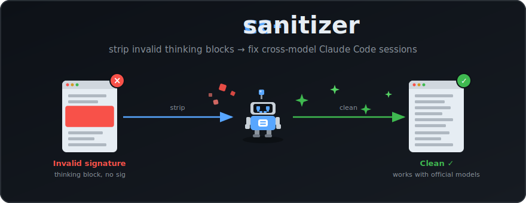

<div align="center">

# cc-sanitizer



[](https://www.npmjs.com/package/cc-sanitizer)
[](https://www.npmjs.com/package/cc-sanitizer)
[](https://www.typescriptlang.org/)
[](LICENSE)

A CLI tool to clean thinking blocks from [Claude Code](https://docs.anthropic.com/en/docs/claude-code) sessions, fixing cross-model compatibility issues.

</div>

---

## About

When you switch between third-party models (GLM, DeepSeek, etc.) and official Anthropic models in Claude Code, the session can break with:

```
400 invalid_request_error: messages.X.content.0: Invalid signature in thinking block
```

This happens because third-party models produce thinking blocks without valid Anthropic signatures. `cc-sanitizer` strips these blocks from your session files so you can continue using official models.

## Installation

```bash
# Run directly (no install needed)
npx cc-sanitizer

# Or install globally
npm install -g cc-sanitizer
```

## Quick Start

```bash
# Scan a session for suspect thinking blocks
cc-sanitizer scan ~/.claude/projects/<project>/<session>.jsonl

# Preview what would be removed
cc-sanitizer strip ~/.claude/projects/<project>/<session>.jsonl --dry-run

# Strip suspect blocks (keeps valid Anthropic signatures)
cc-sanitizer strip ~/.claude/projects/<project>/<session>.jsonl --suspect-only

# Strip all thinking blocks
cc-sanitizer strip ~/.claude/projects/<project>/<session>.jsonl
```

## Commands

### `scan`

Scan session files for thinking blocks and report valid vs suspect signatures.

```bash
# Scan a single session
cc-sanitizer scan session.jsonl

# Scan all sessions in a project
cc-sanitizer scan ~/.claude/projects/my-project/ --project

# Scan all projects
cc-sanitizer scan
```

### `strip`

Remove thinking blocks from session files.

```bash
# Preview changes (dry-run)
cc-sanitizer strip session.jsonl --dry-run

# Strip with backup (default)
cc-sanitizer strip session.jsonl

# Only remove blocks without valid Anthropic signatures
cc-sanitizer strip session.jsonl --suspect-only

# Strip without backup
cc-sanitizer strip session.jsonl --no-backup

# Strip all sessions in a project
cc-sanitizer strip ~/.claude/projects/my-project/ --project
```

**Options:**

| Flag | Description |
|------|-------------|
| `-n, --dry-run` | Preview changes without modifying files |
| `-b, --backup` | Create `.bak` backup before modifying (default: on) |
| `-s, --suspect-only` | Only remove blocks without a valid Anthropic signature |
| `-p, --project` | Treat path as a project directory |

### `restore`

Restore session files from `.bak` backups created by `strip`.

```bash
# Restore a single session
cc-sanitizer restore session.jsonl

# Restore all backups in a project
cc-sanitizer restore ~/.claude/projects/my-project/ --project
```

## How It Works

Claude Code stores sessions as JSONL files in `~/.claude/projects/<encoded-cwd>/<uuid>.jsonl`. Each line is a JSON event; assistant messages contain a `content` array with blocks like `text`, `tool_use`, `thinking`, and `redacted_thinking`.

`cc-sanitizer` parses each assistant message and removes thinking blocks. The remaining content (text, tool results, tool calls) is preserved, keeping the conversation history intact.

### Signature Validation

Anthropic thinking blocks carry a base64-encoded signature (~700-1000 chars). Third-party models either omit this or produce non-standard formats. The `--suspect-only` mode uses this heuristic to distinguish them:

- **Valid**: base64 string, 600-1200 chars
- **Suspect**: missing signature, short string, or non-base64 characters

## Limitations

- **Cannot repair signatures** — Anthropic signatures are generated server-side with private keys. This tool can only remove blocks, not create valid ones.
- **Heuristic detection** — `--suspect-only` uses signature length/format as a heuristic. If a third-party model produces a 600+ char base64 string, it may be missed.
- **Empty events** — If an assistant message contains only thinking blocks, stripping them removes the entire event from the session.

## Related Issues

- [anthropics/claude-code#21726](https://github.com/anthropics/claude-code/issues/21726) — Original bug report
- [anthropics/claude-code#10154](https://github.com/anthropics/claude-code/issues/10154) — Gemini CLI issue

## License

MIT
